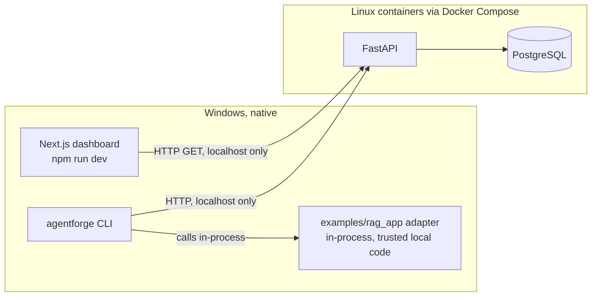
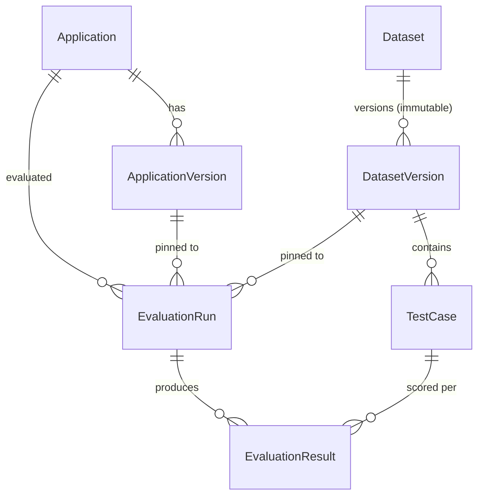

# Architecture — Phase 1

This describes what is actually built, not the eventual full system (see
the root README's "What's next" for what later phases add).

## Component diagram



There is no queue and no worker in Phase 1. The CLI executes the adapter
and the one deterministic evaluator synchronously, in-process, then POSTs
the finished results to the API for persistence. The API's only job in
Phase 1 is persistence and read serving — it does not execute adapters or
evaluators itself.

A future worker (Phase 2+) is explicitly required to run inside a Linux
Docker container, never natively on Windows — this is a standing constraint
for this project, not just a Phase 1 detail.

## Why execution and persistence are split

Evaluation *execution* (running the adapter, scoring it) happens whichever
process the adapter's code lives in — here, the CLI, in-process, on
Windows. *Persistence* is centralized in the API so results, dataset
versions, and evaluator versions are recorded consistently regardless of
what executed them. This split is what lets a future worker replace "the
CLI runs the evaluator synchronously" with "a queue consumer runs it
asynchronously" without changing the API or the data model at all.

## Evaluation run lifecycle (Phase 1)

```
1. agentforge dataset publish <file>.yaml
     -> POST /datasets (upsert by name)
     -> POST /datasets/{id}/versions   (always creates a NEW immutable version)

2. agentforge evaluate --app ... --dataset ... --adapter module:function
     -> POST /applications (upsert)              get-or-create by name
     -> POST /applications/{id}/versions (upsert) get-or-create by (app, version)
     -> GET  /datasets/{name}/versions/{version|latest}
     -> POST /runs                                status=running
     -> [in the CLI process, per test case:]
          adapter(input) -> (answer, retrieved_doc_ids)
          heuristic_context_precision(retrieved, expected) -> score, evidence
     -> POST /runs/{id}/results   (bulk)
     -> POST /runs/{id}/complete  (status=completed, or failed on fatal error)

3. Dashboard "Runs" page
     -> GET /runs           (list, with computed aggregates)
     -> GET /runs/{id}      (detail, with all results + evidence)
```

## Domain model (Phase 1 subset)

Only the entities this vertical slice needs — see the root README's "What's
next" for the rest of the eventual model (Project, Evaluator registry,
Trace/Span, Baseline, ReleasePolicy, etc., none of which exist yet).



Immutability, concretely:

- `DatasetVersion` and its `TestCase` rows: no route ever updates or
  deletes one. Republishing a dataset always inserts the next version
  number (see `apps/api/agentforge_api/routers/datasets.py`).
- `EvaluationRun`: once `status` leaves `running` (via `POST
  /runs/{id}/complete`), no route accepts further `POST
  /runs/{id}/results` for it (`409 Conflict`). There is no update route for
  a run's own fields at all.
- `EvaluationResult`: inserted once, in the results-submission bulk write;
  never updated.

Enforced in `tests/integration/test_dataset_immutability.py` and
`tests/integration/test_evaluation_persistence.py`, not just asserted here.

## Reproducibility metadata recorded per run

`application_version`, `dataset_version` (immutable, so the exact test
cases are always recoverable), `evaluator_name` + `evaluator_version`,
`provider_type` (`local-deterministic` in Phase 1), `environment`,
`threshold`, and `git_commit_sha` (best-effort — `git rev-parse HEAD` in the
CLI's working directory at evaluate time; `null` if not run inside a git
repo).

## Local dev database: SQLite vs. Postgres

Docker wasn't available in the environment this phase was built in, so the
SQLAlchemy layer is driven entirely by `AGENTFORGE_DATABASE_URL`: Postgres
via Docker Compose is the intended/documented setup, and a local SQLite
file (`apps/api/agentforge_dev.db`, via `aiosqlite`) is a same-code-path
fallback for running without Docker. The ORM models and Alembic migration
are identical either way. One real difference was found and is worth
knowing about: SQLite doesn't preserve the UTC-offset suffix on a
`DateTime(timezone=True)` column across a write+re-read the way Postgres
does, so a timestamp can come back as `...12:34:56` instead of
`...12:34:56+00:00` (still the same instant) after a round trip through
SQLite specifically. See the note in
`tests/integration/test_evaluation_persistence.py`.

## Not implemented in Phase 1

Queue/worker, release policy engine and gate, replay, trace/span
persistence, agent trajectory evaluation, safety/adversarial testing,
model comparison, RAG evaluators beyond the one heuristic, Regression/Trace
Explorer/Safety dashboard pages, authentication. See the root README.
