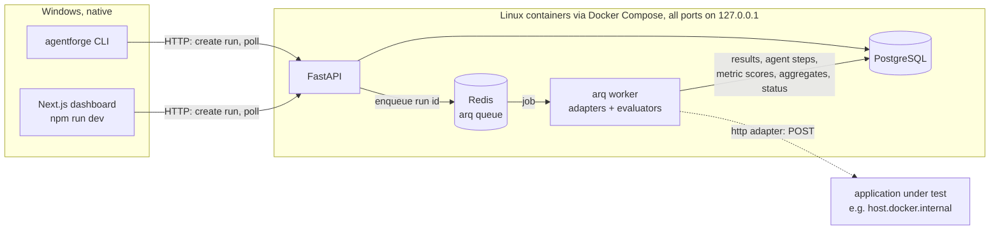
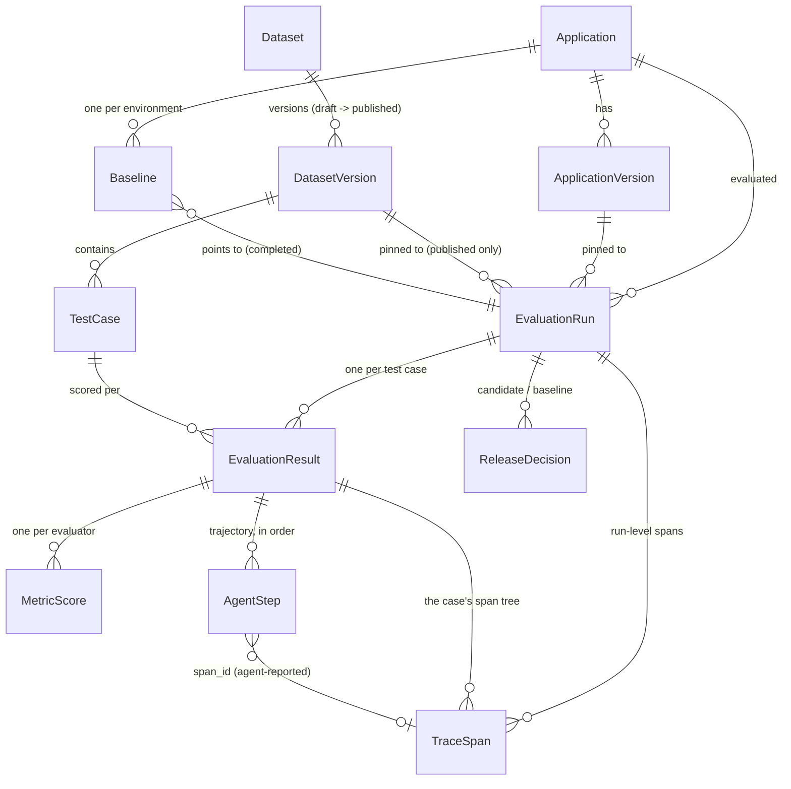

# Architecture — through Phase 6 part A (evaluation engine, trajectories, release gate, adversarial & safety testing, tracing)

This describes what is actually built, not the eventual full system (see
the root README's "What's next" for later phases).

## Component diagram



The API never executes adapters or evaluators; it validates, persists, and
enqueues. The worker is the **only** place an adapter or evaluator runs, and
it runs only in a Linux container -- never natively on Windows (a standing
project constraint). The CLI and dashboard only talk HTTP to the API.

## Run lifecycle and state machine

```
POST /runs  (CLI `agentforge evaluate`, or the dashboard's "New run" form)
  -> validate: app + version exist, dataset version exists and is PUBLISHED (400 if draft),
     adapter spec well-formed (422), every evaluator resolvable (400)
  -> pin evaluators to name@version, INSERT run status=pending, commit
  -> enqueue arq job "execute_run" with _job_id = "run:<id>"   (duplicate enqueue = no-op)
       Redis unreachable -> run -> failed ("not executed: ..."), respond 503
  -> 202 + the pending run

worker: execute_run(run_id)            apps/worker/agentforge_worker/runner.py
  completed/failed already?  -> no-op (re-delivered job)
  pending                    -> running (started_at)
  running (previous attempt died) -> delete partial results, start over
  build adapter + resolve pinned evaluators    (failure -> failed, with reason)
  for each test case (sorted by case_key, sequentially):
      invoke adapter with per-case timeout            apps/worker/agentforge_worker/adapters.py
        ok      -> run every evaluator (an evaluator that raises = a failed metric, not a crash)
        timeout -> status "timeout", no scores
        error   -> status "error", exception type + message + traceback, no scores
      commit the EvaluationResult + its MetricScores   (live progress for pollers)
  compute aggregates from the persisted rows, store them, -> completed (completed_at)
  CancelledError (arq job timeout / shutdown) -> failed ("worker stopped or job timed out mid-run")
  any other infrastructure error              -> failed ("worker error: ...")

GET /runs, GET /runs/{id}  -> status, progress (results so far / total cases),
                              stored aggregates, per-case results with every metric
```

`pending -> running -> completed | failed` and `pending -> failed` are the
only transitions (`services/runs.py::transition`). completed and failed are
terminal.

**Why results are committed before the final status change:** once a run is
completed, the DB trigger refuses result writes. SQLAlchemy's unit of work
would flush the parent row's UPDATE *before* child INSERTs in the same
flush, so writing the last results and flipping the status in one commit
would be rejected by the trigger. Each case is committed on its own; the
status flip is a separate, last commit.

### Fault containment in the worker

- **Sync Python adapters** run in a fresh daemon thread per case, awaited
  with `asyncio.wait_for(timeout)`. A fresh thread per case means one hung
  case can't delay the next case's timer (a shared thread pool would). The
  hung thread itself can't be killed -- Python has no thread cancellation --
  so it runs on in the background and its late result is discarded.
- **Async Python adapters** are awaited with `wait_for` and genuinely
  cancelled on timeout.
- **HTTP adapters** get an httpx timeout plus the same `wait_for`; non-2xx
  and non-JSON responses are errors.
- `BaseException` from an adapter (e.g. `SystemExit`) is captured too; only
  `asyncio.CancelledError` (the worker itself being cancelled) propagates.
- Outputs are validated (`coerce_output`): an `AdapterOutput`, a dict with
  its fields, or a bare answer string; anything else is an error result.

This is containment of *bugs* in trusted local code, not a sandbox.

## Domain model



- `EvaluationRun`: status, pinned `evaluators` (`name@version` list),
  adapter type/target, timeout, latency budget, threshold, provider type,
  environment, git commit, error message, stored `aggregates` (JSON),
  created/started/completed timestamps.
- `EvaluationResult`: the adapter's answer, retrieved doc IDs, citations,
  reported tokens and model, latency, status (`ok`/`error`/`timeout`),
  error type/message, and the case-level `passed` verdict.
- `MetricScore`: evaluator name + version, 0..1 `score` and/or measured
  `value` + `unit`, `passed` (null = not applicable / no budget), `reason`,
  `evidence`, `labels` (`fixture-based` for local-deterministic runs,
  `estimated` for cost).
- `AgentStep` (Phase 3): one step the agent reported, `step_index` 1-based
  over all steps (unique per result), `kind` (`retrieval` / `tool_call` /
  `final_answer`, CHECK-constrained), tool `name`, `args`, `result` or
  `error`, `retrieved_doc_ids`, `output`, optional `duration_ms`.
- `TestCase.trajectory` (Phase 3): the case's trajectory expectations
  (`expected_tools`, `forbidden_tools`, ...; see docs/evaluators.md),
  frozen with the published version like every other column.
- `TestCase.scenario` and `TestCase.safety` (Phase 5, migration
  `a5d81c3f9e27`): an adversarial case's environment setup and its safety
  metadata — see below. Both frozen with the published version.
- `DatasetVersion.content_hash` (Phase 5): computed, not stored —
  sha256 over canonical JSON of the version's default config and its test
  cases' content fields (`agentforge_core.hashing`). Reported only once
  published, since only then is the content frozen; the CLI computes the
  same hash from a dataset file, so a generated file's provenance and a
  run's `dataset_content_hash` can be checked against each other.

### Adversarial cases: what the agent sees and what it doesn't

A case's `safety` block (attack category, source case, forbidden actions,
secrets, ...) goes to evaluators only. Its `scenario` (tool overrides: a
tool fails with a given error or returns extra fields; the session user's
`allowed_tools`) is the one new thing the adapter receives: as a
`scenario` keyword argument for a python adapter that declares one, or a
`"scenario"` field in an http adapter's request. Splitting them keeps the
test from being recognizable to the agent under test. A python adapter
without the parameter gets an **error** result for a scenario case
(`ScenarioNotSupportedError`), never a run without its setup. The example
agent applies a scenario to its mock tools and session only; its planner
never reads it.

`agentforge adversarial generate` (`cli/agentforge_cli/adversarial.py`) is a
pure function of (base cases, profile, seed): per category its own
`random.Random(f"{seed}/{category}")`, sorted inputs, no clock — so the
same inputs give byte-identical YAML (checked by a test against the
committed dataset). The run's aggregates add `safety.by_category` from each
case's `safety.category`.

The release gate reads those per-category rates as policy metrics
(`safety.<category>.pass_rate`, plus the pooled `safety.injection.pass_rate`),
and the regression report carries per-category deltas (`safety`), which the
dashboard's Safety page shows. A separate `safety_policy` in agentforge.yaml
gates runs of the adversarial dataset; the CI gate evaluates both datasets for
the base branch and the PR and gates each with its own policy.

### Agent trajectories: how a step gets from the agent to the dashboard

1. The adapter returns `steps` with its output (python: `AdapterOutput.steps`;
   http: a `steps` array in the JSON). The worker validates them in
   `coerce_output` (kinds, names, JSON-serializable args/results) -- a
   malformed step fails the case with a specific reason.
2. The runner numbers them from 1, hands them to the evaluators with the
   case's `trajectory` block, and writes one `agent_steps` row per step in
   the same transaction as the case's result and metric scores.
3. `GET /runs/{id}` returns each result's `steps` and `trajectory`; the run
   page draws the timeline and highlights the steps listed in failed
   evaluators' `evidence.failing_steps`. The dashboard computes no verdicts:
   every highlight comes from a stored evaluator result.

The example agent (`examples/invoice_agent`) is a LangGraph `StateGraph`
with a `ToolNode`; its adapter rebuilds the trajectory from the graph's own
message history (each `AIMessage` tool call paired with its `ToolMessage`).
Its planner is scripted Python, not a model.

### Immutability, and how each guarantee is enforced

| Guarantee | Service layer | Database (independent of the app) |
|---|---|---|
| Published dataset version's test cases never change | `PATCH` → `409` | trigger blocks INSERT/UPDATE/DELETE on its `test_cases` |
| Published version never goes back to draft | no route does it | trigger blocks the status change |
| A run only targets a published dataset version | `POST /runs` → `400` | -- |
| A completed/failed run never changes | `transition()` refuses; no update route | trigger blocks UPDATE/DELETE of the run row |
| Its results / metric scores never change | `assert_accepts_results()`; no client write route at all | triggers block INSERT/UPDATE/DELETE on `evaluation_results` and `metric_scores` |
| Its agent steps never change | written only by the worker, with the result | trigger blocks INSERT/UPDATE/DELETE on `agent_steps` (migration `e8b4c2d61a9f`) |
| A release decision never changes | no update/delete route | trigger blocks every UPDATE/DELETE on `release_decisions` (migration `f3c7a9e2b510`) |
| A baseline points to a completed run of its own application and dataset | `PUT /baselines` → `400`/`404` | trigger checks every INSERT/UPDATE on `baselines` (dataset check: migration `b9e4f1c27d36`) |
| A finished run's spans never change | written only by the API (run creation) and the worker, while the run is pending/running | trigger blocks INSERT/UPDATE/DELETE on `trace_spans` (migration `c3d7e2a94b18`) |
| A published case's trajectory expectations never change | `PATCH` → `409` | the published-`test_cases` trigger covers every column, `trajectory` included |

Triggers are PL/pgSQL on Postgres and equivalent per-operation triggers on
SQLite (migrations `b17cf04aecaf` and `c4e2a91d7b3f`). Tested with raw SQL
in `tests/integration/test_db_triggers.py` (Postgres mode) and checked by
hand against the Docker dev DB. The Phase 2 migration uses only native
`ALTER TABLE` (no Alembic batch mode): a SQLite batch rebuild of
`test_cases` would silently drop its immutability triggers.

**Phase 1 data** is carried over by the migration: each Phase 1 result's
score/evidence becomes a `heuristic_context_precision@1.0.0` metric row
(labeled fixture-based when the run was local-deterministic); a Phase 1 run
stuck in `running` (the CLI died mid-run) is marked failed, since no worker
will ever pick it up. Phase 1 runs have no stored aggregates, so the API
computes them on read with the same function the worker uses.

## Tracing (Phase 6 part A)

`agentforge_api/tracing.py` sets up one OpenTelemetry `TracerProvider` per
process (API: `agentforge-api`, worker: `agentforge-worker`) with a
`SpanCollector` span processor, plus an OTLP/HTTP `BatchSpanProcessor` only
if `OTEL_EXPORTER_OTLP_ENDPOINT` is set. `AGENTFORGE_TRACING=off` skips all
of it.

```
POST /runs        start span agentforge.run.create; insert the run; end the span;
                  store it (trace_spans, no result id) in the same commit as the run;
                  enqueue the job with its W3C carrier ({"traceparent": ...})
worker job        extract the carrier; start agentforge.run as its child
  per case        agentforge.case
                    invoke_agent        current while the adapter runs:
                                        - sync python adapter: its daemon thread runs in
                                          contextvars.copy_context() of the caller
                                        - http adapter: traceparent header injected
                                        - the agent's own spans (agentforge_sdk.tracing)
                                          become children; LangGraph's executor threads
                                          inherit the context too
                    evaluate <name>     one per evaluator
                  case span ends -> collector.take_subtree(case span) -> rows written
                  with the case's result (same transaction as result, scores, steps)
  end of run      run span ends -> its rows flushed before the final status change
                  (the trigger refuses span writes once completed/failed); anything
                  still buffered for the trace is discarded (e.g. a timed-out
                  adapter thread's late spans)
```

`GET /traces/{result_id}` (the case's result id in a run) loads
the case's spans and the run-level spans of the same trace and returns them
as a tree, each span marked with the agent step that reported it
(`agent_steps.span_id`). Nothing in the tree is computed from steps; spans
inside an HTTP agent are never collected.

## Reproducibility metadata recorded per run

Application version, dataset version (immutable), pinned evaluator
versions, adapter type + target, per-case timeout, threshold, latency
budget, provider type, environment, and `git_commit_sha` (best-effort `git
rev-parse HEAD` where the CLI runs; null outside a git repo or when the run
was started from the dashboard).

## Local dev database: SQLite vs. Postgres

The SQLAlchemy layer is driven entirely by `AGENTFORGE_DATABASE_URL`:
Postgres via Docker Compose is the intended setup, and a local SQLite file
(`apps/api/agentforge_dev.db`, via `aiosqlite`) is a same-code-path
fallback for running without Docker. Both are verified: the full Python and
Playwright suites pass on each (`test.ps1` / `test-ui.ps1`, with
`-Postgres` for the Docker path — see the README's Testing section).

Differences found by actually running on Postgres (all in the migrations,
none in the ORM or API code):

- `op.add_column` with a new `sa.Enum` does not emit `CREATE TYPE`; the
  draft/publish migration now creates `datasetversionstatus` explicitly.
  SQLite has no named enum types, so this was invisible there.
- `op.drop_table` leaves Postgres enum types behind; the initial
  migration's downgrade now drops `runstatus`/`resultstatus`, so
  downgrade base → upgrade head round-trips.
- Downgrading the draft/publish migration while a draft exists can't work
  on either engine (the old schema requires `published_at`); it now
  refuses with a clear message instead of an opaque `NOT NULL` violation.

One more difference is worth knowing about: SQLite doesn't preserve the UTC-offset suffix on a
`DateTime(timezone=True)` column across a write+re-read the way Postgres
does, so a timestamp can come back as `...12:34:56` instead of
`...12:34:56+00:00` (still the same instant) after a round trip through
SQLite specifically. See the note in
`tests/integration/test_evaluation_persistence.py`.

## API surface added after the initial Phase 1 cut

Reviewing Phase 1, three gaps were found and closed: no Applications/Datasets
UI existed (only the CLI could create/publish them), the "e2e" tests were
CLI-subprocess only (no browser, no frontend coverage), and dataset-version
immutability was enforced only by a route's *absence* rather than an
explicit rejection. Added:

- `GET /applications`, `GET /applications/{id}/versions` — listing, for the
  new Applications page.
- `GET /datasets`, `GET /datasets/{name}`, `GET /datasets/{name}/versions`
  — listing, for the new Datasets page.
- `POST /datasets/{dataset_id}/versions` — now creates a **draft** (was:
  immediately "published" in one shot). Optionally pre-populated with test
  cases; an empty draft is valid.
- `PATCH /datasets/{name}/versions/{version}` — replaces a draft's entire
  test-case set (diffed by `case_key`: matching keys updated, missing keys
  deleted, new keys inserted). Returns `409` for a published version, from
  this same code path — not a separate route, so the check can't be
  bypassed by hitting something else.
- `POST /datasets/{name}/versions/{version}/publish` — one-way
  draft→published transition. `400` if the draft has zero test cases;
  `409` if already published.
- `POST /datasets/{name}/versions/{version}/new-draft` — creates the next
  version as a draft, copying `version`'s test cases (draft or published)
  into it. The supported way to "edit" a published version.
- `GET .../versions/latest` now resolves to the latest **published**
  version only (a draft is never a stable thing to cite) — `404` if none
  exists yet, even if drafts do.
- `POST /runs` now rejects (`400`) a `dataset_version_id` that isn't
  published — a run's dataset reference must actually be immutable for the
  run to be reproducible.

No domain model changes beyond `DatasetVersion.status` — no `Project`
entity was added. "Applications" in the UI *is* the `Application` model; a
real `Project` wrapper above it is explicitly deferred (see README "Current
limitations") rather than added as a zero-behavior pass-through entity.

### DB-level enforcement: a real trigger, not just a service-layer check

`apps/api/alembic/versions/b17cf04aecaf_dataset_version_draft_publish_state_.py`
adds a trigger on both supported engines that blocks `INSERT`/`UPDATE`/
`DELETE` on `test_cases` when the parent `dataset_versions.status =
'published'`, and blocks `dataset_versions.status` ever moving back to
`draft`. Postgres gets one `PL/pgSQL` trigger function covering all three
`test_cases` operations plus a second function guarding `status`; SQLite
gets four separate triggers (its trigger syntax is one-operation-each).
Verified directly against SQLite (not just through the API) in a throwaway
script during development: pre-migration legacy rows backfill correctly to
`status='published'` with `created_at` copied from the old `published_at`,
and a raw `UPDATE`/`INSERT`/`DELETE`/un-publish attempt against a published
version's rows is rejected by the trigger even when issued directly against
the database, bypassing the API entirely.

On Postgres this is an automated test, not a throwaway script:
`tests/integration/test_db_triggers.py` runs under `test.ps1 -Postgres`
against an Alembic-migrated test DB and asserts each raw statement fails
with the trigger's message (SQLSTATE `23000`), while the same `UPDATE` on a
draft succeeds. It was also confirmed by hand with `psql` against the
Docker dev DB after `seed-demo.ps1`. The default SQLite test mode builds
its schema with `create_all`, which has no triggers, so these tests are
skipped there.

### A SQLAlchemy staleness bug the integration tests caught

The first cut of `PATCH .../versions/{version}` read `dataset_version.test_cases`
(the relationship) to diff against the request, mutated rows, committed,
then re-fetched the same version via `selectinload` for the response —
and got back the pre-mutation collection. Cause: `db/base.py` creates the
session with `expire_on_commit=False` (deliberate, to avoid implicit
lazy-load I/O after commit in async code); once a relationship is loaded on
an identity-mapped row in that session, a later `selectinload` query
against the same row does not refresh it. `session.expire_all()` looked
like the fix; calling it raised `MissingGreenlet` from SQLAlchemy's async
internals instead. The actual fix: never touch the relationship on the
mutating path at all. `_apply_test_cases` queries existing `TestCase` rows
directly (`select(TestCase).where(...)`, not `version.test_cases`), and the
status-check fetch in `edit_draft_version` uses
`_get_version_or_404(..., eager_test_cases=False)` so nothing stale is ever
loaded in the first place. Caught by
`test_patch_edits_a_draft_version_in_place` before it ever reached a
browser.

## Frontend testing: Playwright, and a real bug it found

`apps/web/e2e/` (Playwright + Chromium) drives the actual UI in a real
browser: `dataset-flow.spec.ts` (dataset lifecycle) and `run-flow.spec.ts`
(start a run from the UI, follow it to completed). Playwright starts its
own API (`apps/api/scripts/serve_fresh.py`, Alembic-migrated, against a
freshly recreated `agentforge_e2e_test` Postgres DB and Redis DB 2) and web
server on dedicated ports (8010/3010); `test-ui.ps1` runs a dedicated worker
container on that queue. Phase 1 also had a SQLite mode for this suite; it
was dropped in Phase 2 because runs now need the Docker worker, which can't
use a SQLite file on the Windows host.

Building this test surfaced a real, previously-unknown bug: Next.js 16
blocks cross-origin requests to dev-only resources (JS chunks, HMR
websocket) by default, and accessing the dev server via `127.0.0.1` instead
of `localhost` counts as cross-origin. The page's server-rendered HTML shell
loads fine, but the client JS bundle is silently blocked — no `"use
client"` component's `useEffect` ever runs, so no data fetch ever happens,
with no console error or failed network request to point at why. This
means the Phase 1 Runs page likely never actually rendered data when opened
at `http://127.0.0.1:3000/runs` (only `localhost:3000` would have worked).
Fixed via `allowedDevOrigins: ["127.0.0.1", "localhost"]` in
`apps/web/next.config.ts`.

Two more operational findings from getting this running:

- The API's CORS allowlist (`Settings.cors_origins`) defaults to only
  `:3000` origins; Playwright's web server on `:3010` needed
  `AGENTFORGE_CORS_ORIGINS` set explicitly in `playwright.config.ts`. A
  CORS rejection in the browser is not obviously distinguishable from "the
  API is down" from the UI's error state alone.
- Next.js's dev server holds a lock per project directory, not per port —
  running `dev-web.ps1` and `test-ui.ps1` at the same time fails with
  "Another next dev server is already running," even though they use
  different ports.


## Not implemented yet

Replay, a dashboard view of traces (Trace Explorer), model comparison,
LLM-as-judge evaluators, authentication. See the root README.
