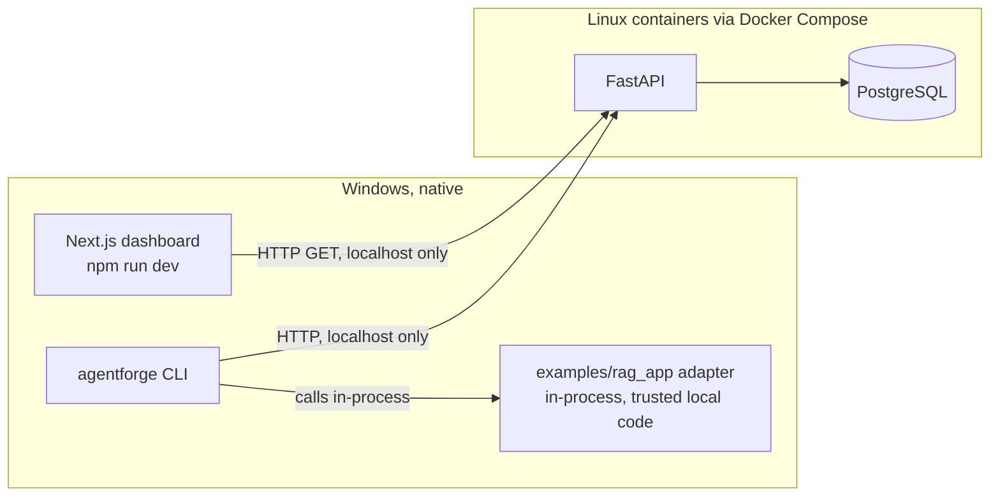
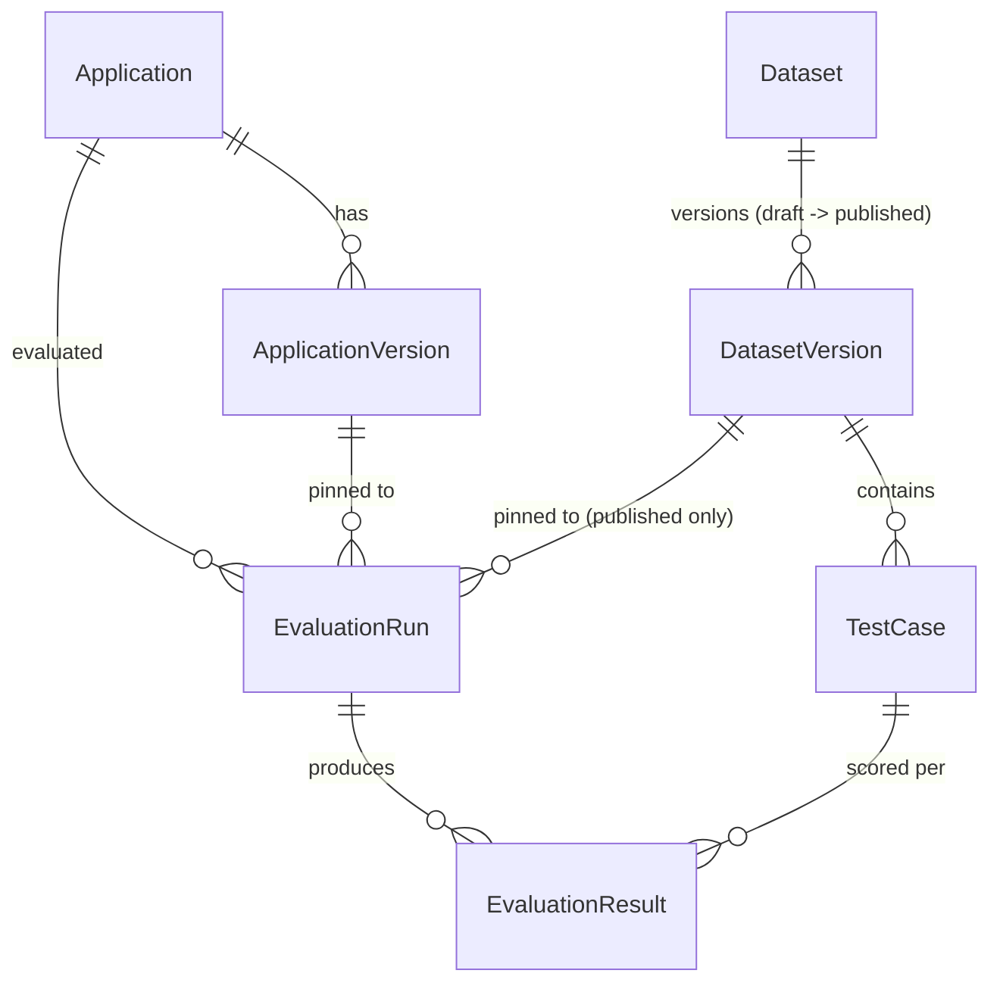

# Architecture — Phase 1

This describes what is actually built, not the eventual full system (see
the root README's "What's next" for what later phases add).

## Component diagram



There is no queue and no worker in Phase 1. The CLI executes the adapter
and the one deterministic evaluator synchronously, in-process, then POSTs
the finished results to the API for persistence. The API's only job in
Phase 1 is persistence and read serving — it does not execute adapters or
evaluators itself.

A future worker (Phase 2+) is explicitly required to run inside a Linux
Docker container, never natively on Windows — this is a standing constraint
for this project, not just a Phase 1 detail.

## Why execution and persistence are split

Evaluation *execution* (running the adapter, scoring it) happens whichever
process the adapter's code lives in — here, the CLI, in-process, on
Windows. *Persistence* is centralized in the API so results, dataset
versions, and evaluator versions are recorded consistently regardless of
what executed them. This split is what lets a future worker replace "the
CLI runs the evaluator synchronously" with "a queue consumer runs it
asynchronously" without changing the API or the data model at all.

## Evaluation run lifecycle (Phase 1)

```
1. agentforge dataset publish <file>.yaml
     -> POST /datasets (upsert by name)
     -> POST /datasets/{id}/versions          (creates a new DRAFT version)
     -> POST /datasets/{name}/versions/{v}/publish  (freezes it)
     One CLI command, two API calls -- same draft-then-publish path the UI uses.

2. agentforge evaluate --app ... --dataset ... --adapter module:function
     -> POST /applications (upsert)              get-or-create by name
     -> POST /applications/{id}/versions (upsert) get-or-create by (app, version)
     -> GET  /datasets/{name}/versions/{version|latest}
     -> POST /runs                                status=running
     -> [in the CLI process, per test case:]
          adapter(input) -> (answer, retrieved_doc_ids)
          heuristic_context_precision(retrieved, expected) -> score, evidence
     -> POST /runs/{id}/results   (bulk)
     -> POST /runs/{id}/complete  (status=completed, or failed on fatal error)

3. Dashboard "Runs" page
     -> GET /runs           (list, with computed aggregates)
     -> GET /runs/{id}      (detail, with all results + evidence)
```

## Domain model (Phase 1 subset)

Only the entities this vertical slice needs — see the root README's "What's
next" for the rest of the eventual model (Project, Evaluator registry,
Trace/Span, Baseline, ReleasePolicy, etc., none of which exist yet).



Immutability, concretely:

- `DatasetVersion` is a two-state object: `draft` (mutable) or `published`
  (frozen forever). `status` only ever moves one direction, via `POST
  .../publish`. While a version is a draft, its `TestCase` rows can be
  inserted/updated/deleted (`PATCH .../versions/{version}`, diffed by
  `case_key` against the request body — see `apps/api/agentforge_api/routers/datasets.py`).
  Once published, that same `PATCH` route returns `409 Conflict` for that
  version, and a **DB trigger blocks the mutation independent of the API**
  (a real Postgres trigger function + real SQLite triggers, not a comment —
  see the `dataset_version_immutability` migration,
  `apps/api/alembic/versions/b17cf04aecaf_*.py`). "Editing" a published
  version's content means `POST .../new-draft`: copy its test cases into a
  brand-new draft (next version number), edit that, publish it.
- `EvaluationRun` may only target a **published** `DatasetVersion`
  (`POST /runs` returns `400` for a draft) — this is what makes a run's
  dataset reference actually reproducible: it can never change under it.
  Once `status` leaves `running` (via `POST /runs/{id}/complete`), no route
  accepts further `POST /runs/{id}/results` for it (`409 Conflict`). There
  is no update route for a run's own fields at all.
- `EvaluationResult`: inserted once, in the results-submission bulk write;
  never updated.

Enforced in `tests/integration/test_dataset_immutability.py` and
`tests/integration/test_evaluation_persistence.py`, not just asserted here.

## Reproducibility metadata recorded per run

`application_version`, `dataset_version` (immutable, so the exact test
cases are always recoverable), `evaluator_name` + `evaluator_version`,
`provider_type` (`local-deterministic` in Phase 1), `environment`,
`threshold`, and `git_commit_sha` (best-effort — `git rev-parse HEAD` in the
CLI's working directory at evaluate time; `null` if not run inside a git
repo).

## Local dev database: SQLite vs. Postgres

Docker wasn't available in the environment this phase was built in, so the
SQLAlchemy layer is driven entirely by `AGENTFORGE_DATABASE_URL`: Postgres
via Docker Compose is the intended/documented setup, and a local SQLite
file (`apps/api/agentforge_dev.db`, via `aiosqlite`) is a same-code-path
fallback for running without Docker. The ORM models and Alembic migration
are identical either way. One real difference was found and is worth
knowing about: SQLite doesn't preserve the UTC-offset suffix on a
`DateTime(timezone=True)` column across a write+re-read the way Postgres
does, so a timestamp can come back as `...12:34:56` instead of
`...12:34:56+00:00` (still the same instant) after a round trip through
SQLite specifically. See the note in
`tests/integration/test_evaluation_persistence.py`.

## API surface added after the initial Phase 1 cut

Reviewing Phase 1, three gaps were found and closed: no Applications/Datasets
UI existed (only the CLI could create/publish them), the "e2e" tests were
CLI-subprocess only (no browser, no frontend coverage), and dataset-version
immutability was enforced only by a route's *absence* rather than an
explicit rejection. Added:

- `GET /applications`, `GET /applications/{id}/versions` — listing, for the
  new Applications page.
- `GET /datasets`, `GET /datasets/{name}`, `GET /datasets/{name}/versions`
  — listing, for the new Datasets page.
- `POST /datasets/{dataset_id}/versions` — now creates a **draft** (was:
  immediately "published" in one shot). Optionally pre-populated with test
  cases; an empty draft is valid.
- `PATCH /datasets/{name}/versions/{version}` — replaces a draft's entire
  test-case set (diffed by `case_key`: matching keys updated, missing keys
  deleted, new keys inserted). Returns `409` for a published version, from
  this same code path — not a separate route, so the check can't be
  bypassed by hitting something else.
- `POST /datasets/{name}/versions/{version}/publish` — one-way
  draft→published transition. `400` if the draft has zero test cases;
  `409` if already published.
- `POST /datasets/{name}/versions/{version}/new-draft` — creates the next
  version as a draft, copying `version`'s test cases (draft or published)
  into it. The supported way to "edit" a published version.
- `GET .../versions/latest` now resolves to the latest **published**
  version only (a draft is never a stable thing to cite) — `404` if none
  exists yet, even if drafts do.
- `POST /runs` now rejects (`400`) a `dataset_version_id` that isn't
  published — a run's dataset reference must actually be immutable for the
  run to be reproducible.

No domain model changes beyond `DatasetVersion.status` — no `Project`
entity was added. "Applications" in the UI *is* the `Application` model; a
real `Project` wrapper above it is explicitly deferred (see README "Current
limitations") rather than added as a zero-behavior pass-through entity.

### DB-level enforcement: a real trigger, not just a service-layer check

`apps/api/alembic/versions/b17cf04aecaf_dataset_version_draft_publish_state_.py`
adds a trigger on both supported engines that blocks `INSERT`/`UPDATE`/
`DELETE` on `test_cases` when the parent `dataset_versions.status =
'published'`, and blocks `dataset_versions.status` ever moving back to
`draft`. Postgres gets one `PL/pgSQL` trigger function covering all three
`test_cases` operations plus a second function guarding `status`; SQLite
gets four separate triggers (its trigger syntax is one-operation-each).
Verified directly against SQLite (not just through the API) in a throwaway
script during development: pre-migration legacy rows backfill correctly to
`status='published'` with `created_at` copied from the old `published_at`,
and a raw `UPDATE`/`INSERT`/`DELETE`/un-publish attempt against a published
version's rows is rejected by the trigger even when issued directly against
the database, bypassing the API entirely.

### A SQLAlchemy staleness bug the integration tests caught

The first cut of `PATCH .../versions/{version}` read `dataset_version.test_cases`
(the relationship) to diff against the request, mutated rows, committed,
then re-fetched the same version via `selectinload` for the response —
and got back the pre-mutation collection. Cause: `db/base.py` creates the
session with `expire_on_commit=False` (deliberate, to avoid implicit
lazy-load I/O after commit in async code); once a relationship is loaded on
an identity-mapped row in that session, a later `selectinload` query
against the same row does not refresh it. `session.expire_all()` looked
like the fix; calling it raised `MissingGreenlet` from SQLAlchemy's async
internals instead. The actual fix: never touch the relationship on the
mutating path at all. `_apply_test_cases` queries existing `TestCase` rows
directly (`select(TestCase).where(...)`, not `version.test_cases`), and the
status-check fetch in `edit_draft_version` uses
`_get_version_or_404(..., eager_test_cases=False)` so nothing stale is ever
loaded in the first place. Caught by
`test_patch_edits_a_draft_version_in_place` before it ever reached a
browser.

## Frontend testing: Playwright, and a real bug it found

`apps/web/e2e/dataset-flow.spec.ts` (Playwright + Chromium) drives the
actual UI in a real browser — distinct from `tests/e2e/` at the repo root,
which is CLI-subprocess-only and never touches a browser. Playwright starts
its own API (fresh temp SQLite, `apps/api/scripts/serve_fresh.py`) and web
server on dedicated ports (8010/3010) so it never collides with a manually
running dev setup.

Building this test surfaced a real, previously-unknown bug: Next.js 16
blocks cross-origin requests to dev-only resources (JS chunks, HMR
websocket) by default, and accessing the dev server via `127.0.0.1` instead
of `localhost` counts as cross-origin. The page's server-rendered HTML shell
loads fine, but the client JS bundle is silently blocked — no `"use
client"` component's `useEffect` ever runs, so no data fetch ever happens,
with no console error or failed network request to point at why. This
means the Phase 1 Runs page likely never actually rendered data when opened
at `http://127.0.0.1:3000/runs` (only `localhost:3000` would have worked).
Fixed via `allowedDevOrigins: ["127.0.0.1", "localhost"]` in
`apps/web/next.config.ts`.

Two more operational findings from getting this running:

- The API's CORS allowlist (`Settings.cors_origins`) defaults to only
  `:3000` origins; Playwright's web server on `:3010` needed
  `AGENTFORGE_CORS_ORIGINS` set explicitly in `playwright.config.ts`. A
  CORS rejection in the browser is not obviously distinguishable from "the
  API is down" from the UI's error state alone.
- Next.js's dev server holds a lock per project directory, not per port —
  running `dev-web.ps1` and `test-ui.ps1` at the same time fails with
  "Another next dev server is already running," even though they use
  different ports.

## Not implemented in Phase 1

Queue/worker, release policy engine and gate, replay, trace/span
persistence, agent trajectory evaluation, safety/adversarial testing,
model comparison, RAG evaluators beyond the one heuristic, Regression/Trace
Explorer/Safety dashboard pages, authentication. See the root README.
